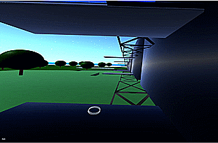

# [Convolvr](https://convolvr.io/) &middot; [](https://badge.fury.io/js/convolvr) [](https://opensource.org/licenses/MIT)


## Overview
- [Component](https://github.com/Convolvr/convolvr/blob/dev/client/src/js/component.js) [Entity](https://github.com/Convolvr/convolvr/blob/dev/client/src/js/entity.js) [System](https://github.com/Convolvr/convolvr/blob/dev/client/src/js/systems/index.js) [Framework](https://github.com/Convolvr/convolvr/wiki) built on [Three.js](https://github.com/mrdoob/three.js)
- Multiplayer telemetry, chat, action & asset persistence provided by server using [Nexus](https://github.com/ds0nt/nexus)
- Built in tools to combine pre-made components components
- Tools to visually build and bind data between components (geometries, materials & other attributes and events)
- [Embedded scripting language](https://github.com/Convolvr/ecs) for complex component behaviour
- Support for keyboard/mouse, touch screen, gyro, tracked controllers
- Supports infinite, configurable, procedural environments 
- Mesh based VR UI; Multiline text rendering

## Installation
```shell
  git clone https://github.com/convolvr/convolvr
  go get github.com/Convolvr/core
  go get github.com/Convolvr/server
  go get github.com/Convolvr/generate
  cd convolvr/client && npm install && gulp build &
  cd ../cmd && go build # && ./cmd # to start server
```

## Development 
```shell
  cd convolvr/client && gulp # watchify
  cd convolvr/cmd && go build # && ./cmd # to start server
```
[Wiki](https://github.com/Convolvr/convolvr/wiki/Development)

### Initialization Example 
(https://github.com/Convolvr/convolvr/blob/dev/client/src/main.ts)

### Entity / System Mapping 
See [core/attribute.ts](https://github.com/Convolvr/convolvr/blob/task/computer-hardware%2Bsoftware/client/src/core/attribute.ts#L95)
```js
{
  id: -4,
  name: "chat-screen",
  components: [
    {
      attrs: {
          geometry: {
              shape: "box",
              size: [ 3, 3, 0.25 ]
          },
              material: {
              color: 0x808080,
              name: "plastic"
          },
          chat: {
              userId: "all",
              displayMessages: true
          },
          text: {
              lines: [ 
                  "Welcome To Convolvr", 
              ],
              color: "#ffffff",
              background: "#000000"
          }
      },
      quaternion: [ 0, 0, 0, 1 ],
      position: [ 0, 0, 0 ]
    }
  ]
}
```
## Server Examples
- [Generating Buildings](https://github.com/Convolvr/generate/blob/dev/building.go)
- [Handling User Actions](https://github.com/convolvr/server/blob/dev/socket.go#L17)
